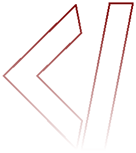

 

<strong>Hello world! :coffee:  </strong> Opa, tudo bom? .

<h1></h1>

<h3>Tecnologias :wink::</h3>

 

  
  
  
  
  
  
  
  
  
  
  

 

 
<h1></h1>

<h3>Caso queira entrar em contato:</h3>

  
  
  
  
  
  
  

<h1/>
